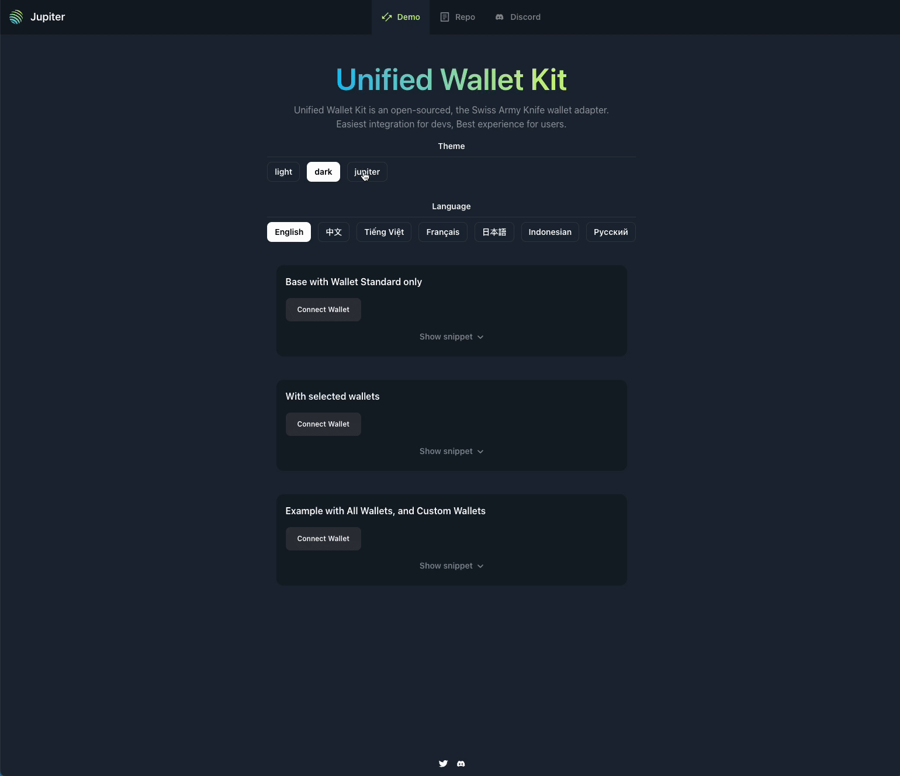
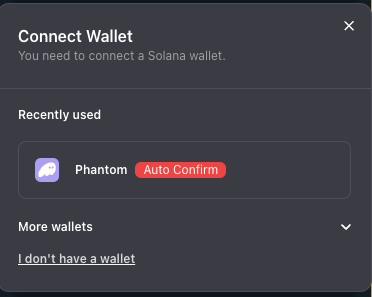

# Unified Wallet Kit



Unified Wallet Kit is an open-sourced, Swiss Army Knife wallet adapter, striving for the best wallet integration experience for developers, and best wallet experience for your users.

Along with [Terminal](https://terminal.jup.ag), it's the fastest way to get started on Solana.

Used by Jupiter and Meteora.

NPM: https://www.npmjs.com/package/@jup-ag/wallet-adapter

## Motives

Why not just use the existing wallet adapters?

- To bootstrap a dApp, we always find ourself doing the same thing over and over again, such as:
  - Notification when wallets are selected, connecting, connected, disconnected.
  - Auto reconnect to the last connected wallet
  - Mobile-first, responsive design
  - Themeing support
  - Internationalization (i18n) support
  - New user onboarding
- Built on-top of `@solana/wallet-adapter-base`, `@solana/wallet-adapter-react` and `@solana-mobile/wallet-adapter-mobile`, you are always welcomed to onboard or depart.

## Philosophy

- Set a sensible defaults
- Lightweight, easy to adopt, fast to access
- Extensible wallets, with a BYOW (Bring your own wallets) approach
- Better onboarding experience for new users

## Core features

- [x] Main esm bundle at 94Kb (~20Kb gzipped)
- [x] Built-in Wallet Standard, Mobile Wallet Adapter support
- [x] Abstracted wallet adapter, with a BYOW (Bring your own wallets) approach
- [x] Mobile responsive
- [x] Notification plug-in
- [x] Internationalization (i18n)

  - More contributions required for more languages
  - Currently generated from Copilot
  - [Help contribute](https://github.com/TeamRaccoons/Unified-Wallet-Kit/blob/main/src/contexts/TranslationProvider/i18n.ts)

- [x] New user onboarding [on Jupiter Station](https://station.jup.ag/partners?category=Wallets)
  - PR welcomed on [Jupiter Station Github](https://github.com/jup-ag/space-station/)
- [x] Theming
  - Light, Dark, Jupiter
  - More thmes coming soon
- [x] Pluralization for i18n

## Getting Started

- `pnpm i @jup-ag/wallet-adapter`
- Wrap your app with `<UnifiedWalletProvider />` and pass in as little to as many wallets you would like to support.
- Below example is `ExampleBaseOnly.tsx`

```tsx
const ExampleBaseOnly = () => {
  return (
    <UnifiedWalletProvider
      wallets={[]}
      config={{
        autoConnect: false,
        env: 'mainnet-beta',
        metadata: {
          name: 'UnifiedWallet',
          description: 'UnifiedWallet',
          url: 'https://jup.ag',
          iconUrls: ['https://jup.ag/favicon.ico'],
        },
        notificationCallback: WalletNotification,
        walletlistExplanation: {
          href: 'https://station.jup.ag/docs/additional-topics/wallet-list',
        },
      }}
    >
      <UnifiedWalletButton />
    </UnifiedWalletProvider>
  );
};

export default ExampleBaseOnly;
```

- More example can be found on the demo page, or in `src/components/examples`

## More features

- [x] Wallet attachment
  - Target specific wallet and attach custom element to it
  - 

```tsx
config={{
  walletAttachments: { 
    'Phantom': {
      attachment: <div tw="text-xs rounded-md bg-red-500 px-2 mx-2 text-center">Auto Confirm</div>
    } 
  }
}}
```

## FAQs

- Why not ship with all wallets?

  - Unnecessary bloat and bundle size on your dApp
  - It's not sensible to always maintain an ever-growing list of wallets
  - Many existing wallets are not well maintained, often with unpatched security, or abandoned development
  - Lack of users
  - Does not support Versioned Transaction, severely limiting the adoption of many innovative functionalities of dApp.
  - And hopefully, a gradually disappearing list of installed wallet adapter, as they migrate to wallet-standard

- Why not ship with notification by default

  - Existing dApp might already have their own notification system
  - Checkout `src/components/examples/WalletNotification.tsx` for an example of how to use the notification system

- How to add/develop a new wallet?
  - We recommend new developer develops Wallets that comforms to WalletStandard or MWA, to get instant discoverability.
  - https://github.com/solana-labs/wallet-adapter/blob/master/WALLET.md

### #By Raccoons


